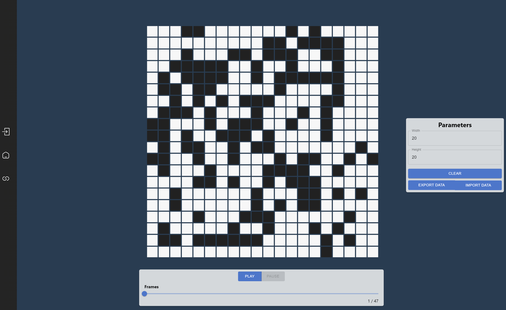

# GameOfLife - Visual

This repository is the visual of the Game Of Life algorithm. It also serve as a example to how create a visual for CAMI app.
You can create your own visual by following the instructions in this document.

## Requirements

- CAMI (Cellular Automata application)
- Compatible development environment (see CAMI documentation)

For now, you must create a visual by using React.

## Getting started

To begin with, you should follow the architecture of the example visual but you can organize your code freely.
But there is some madatories to make your code working on CAMI.

### 1. Configuration

As you can see, this visual use a vite configuration. You can use the one you want but you must end with **one js file** when you build your app.

### 2. Messages

In order to make the communication between the host app and your visual work, you have to send and receive several messages.
Here's a table of all the messages and their usage :

| Message Name | Usage | Emitter |
| ------------ | ----- | ------- |
| UPDATE_TABLE | Informs that the table changed | Application |
| PARAMETERS | Gives all parameters that a simulation needs | Application |
| PLAY_SIMULATION | Informs that the simulation started | **Visual** |
| PAUSE_SIMULATION | Informs that the simulation paused | **Visual** |
| EXPORT | Allows to export current settings of the simulation | **Visual** |
| IMPORT | Allows to imports settings to a simulation | **Visual** |
| IMPORTED_DATA | Give settings of imported save | Application |

:warning: **All the messages where the emitter is *visual* must be send by you and all the other messages must be intercept by you** :warning:

Here's the architecture of a message :

`
Message = {
    action: "ACTION_NAME",
    data: {data}
}
`

In action, you can find what kind of message it is and in data, the data sended through the message.

:warning: **When you send a message, you must follow the same architexture of message** :warning:

For each message, here's what must be in :

**UPDATE_TABLE**

`
    {
        action : "UPDATE_TABLE",
        data : {
            table : [...]
        }
    }
`
Depending on how the algorithm were developped, the format of the table can change

**PARAMETERS**

`
    {
        action : "PARAMETERS",
        data : {
            parameters : [
                {
                    name: "parameter name",
                    type: "parameter type"
                }
            ]
        }
    }
`

Parameter type can be a **Number**, a **String** or a **Table**

**PLAY_SIMULATION**

`
    {
        action : "UPDATE_TABLE",
        data : {
            parameters : [...],
            table : [...]
        }
    }
`

The parameters must be send in the same order than the ones you received by the message **PARAMETERS**

**PAUSE_SIMULATION**

`
    {
        action : "PAUSE_SIMULATION",
    }
`

:red_circle: No data needed

**EXPORT**

`
    {
        action : "PAUSE_SIMULATION",
        data : {
            parameters : [...],
            table : [...],
        }
    }
`

**IMPORT**

`
    {
        action : "IMPORT",
    }
`

:red_circle: No data needed

**IMPORTED_DATA**

`
    {
        action : "IMPORTED_DATA",
        data : {
            parameters : [...],
            table : [...]
        }
    }
`

### How communicate ?

You can communicate with the app by only one manner :
`
    window.electronAPI.sendToHost(message)
`

And you can receive its messages by listening to the window :
`
    window.addEventListener('message', (message) => {})
`